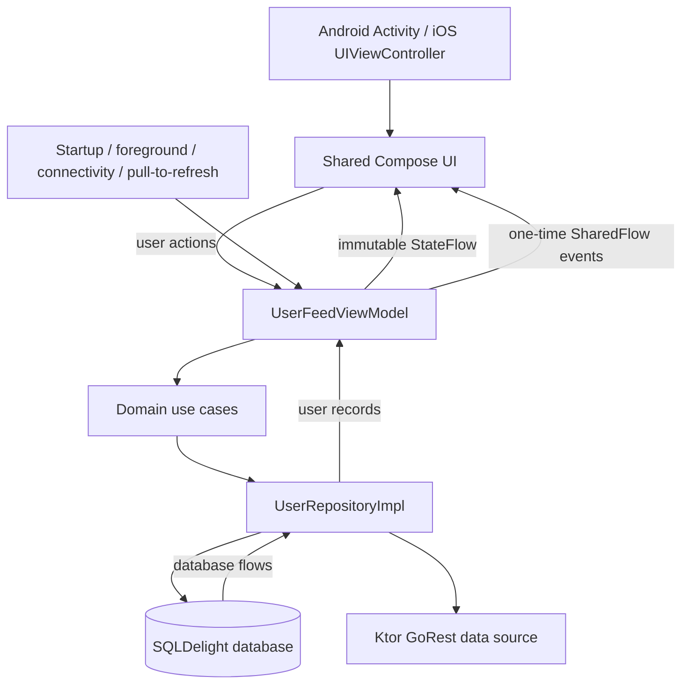

# 👤 User Management System

> A production-minded **Kotlin Multiplatform** user directory for Android and iOS.

The app shares its **Compose UI, ViewModel, domain rules, repository, Ktor client, SQLDelight schema, and dependency graph**.

The feed reads from the local database at all times. Network work refreshes that database in the background, so cached and locally created users remain useful through connectivity and server failures.


---

## ✨ What It Demonstrates

* 📱 Portrait uses a one-column feed; landscape uses an exact two-column grid.
* 🎨 Shared Material 3 light/dark presentation and accessible loading, empty, offline, and error states.
* 👤 Server-confirmed user creation: rows are added only after HTTP `201`, and API validation errors are shown in the form.
* 🗑️ Long-press delete that removes the remote user first, then offers Undo to recreate it.
* 🔄 Lifecycle- and connectivity-aware refreshes with one serialized repository operation at a time.
* 🧪 Deterministic shared, persistence, Compose, and platform dependency-injection tests.

---

## 🏗️ Architecture

The app uses **MVVM and unidirectional data flow**.

Platform code supplies lifecycle, connectivity, network-engine, SQL-driver, and token configuration implementations; feature behavior stays in `shared`.



### 🔄 Repository Synchronization

The repository serializes each:

* 🔄 Refresh
* 📄 Page load
* ➕ Create
* 🗑️ Delete
* ↩️ Restore / Undo

A successful initial GoRest `/users` response replaces the stored remote snapshot in one transaction.

A failure leaves the current database and pagination cursor intact.

Reaching the feed end appends the page named by `X-Links-Next`:

```text
page=2 → page=3 → page=4 → ...
```

New server-confirmed users have no server position until a refresh, so the query shows them first by local observation time and descending local ID.

For more details:

* 📐 [`docs/architecture.md`](docs/architecture.md)
* 🔀 [`docs/state-transitions.md`](docs/state-transitions.md)

---

## 🤖 AI-assisted Development

AI was used as a development accelerator throughout the project, mainly to reduce setup time, speed up unfamiliar areas, and catch implementation details early.

### 🧠 Upfront Planning

AI was used as a thinking partner during the initial planning phase.

Through an iterative question-and-answer process, it helped me:

* Clarify requirements
* Challenge assumptions
* Surface overlooked details
* Define technical scope
* Turn broad requirements into a concrete development plan
* Set up a solid plan to execute

### 🏃 Sprint-based Implementation

The work was split into small, achievable sprints, with each sprint having a clear target.

This made it easier to implement and verify the project step by step rather than trying to build the entire system at once.

### 📚 Picking Up Unfamiliar Libraries

When i working with libraries or frameworks that I had not used/less experience before, AI provided a quick way to understand:

* APIs
* Typical usage patterns
* Integration points
* Diff between similar libraries, such as Room KMP VS SQLDelight. I know database. I know Room. But i never use SQLDelight.

This reduced the time spent getting familiar with new technologies and allowed implementation to continue without a long learning cycle.

### 🍎 Cross-platform Setup

As an Android-focused developer with less experience on iOS, AI was particularly useful for getting the iOS side of the Kotlin Multiplatform project running quickly.

It helped me with:

* Project configuration
* Xcode setup
* Platform-specific integration
* Troubleshooting initial setup issues

### 🔍 Handling Implementation Details

AI was also useful for checking details that are easy to miss during development.

Database changes are a good example, where schema updates and migrations can easily introduce errors. Using AI as an additional check helped identify potential migration issues and reduced the chance of small implementation mistakes making their way into the final build.

> 💡 AI-generated suggestions were treated as implementation assistance rather than authority.
>
> Changes were still reviewed against the requirements and architecture, then verified through tests and platform builds.

---

## ⚙️ Prerequisites

Before running the project, make sure you have:

* 🟣 Android Studio with the Android SDK configured
* ☕ A JDK compatible with the Gradle wrapper
* 🍎 Xcode
* 💻 An Apple-silicon Mac with an iOS Simulator
* 🔑 A GoRest access token for create/delete operations

> ℹ️ Public feed loading works without a GoRest token.

> ⚠️ **Never commit a real token.**
>
> Local configuration files are ignored by Git, and tracked examples contain placeholders only.

---

## 🔐 Token Configuration

### 🌐 Shared Android & iOS Token

Keep the `sdk.dir` generated by Android Studio in the root `local.properties`, then add:

```properties
GOREST_ACCESS_TOKEN=YOUR_GOREST_ACCESS_TOKEN
```

[`local.properties.example`](local.properties.example) contains the same placeholder.

Android reads this file through Gradle.

The iOS build extracts `GOREST_ACCESS_TOKEN` from it into the local app bundle.

This means **one local token configures both apps**.

A `GOREST_ACCESS_TOKEN` Gradle property or environment variable also works for Android and takes precedence over `local.properties`.

### 🔄 After Changing the Token

The token is included in each app's local build.

After changing it:

1. Rebuild the application
2. Reinstall the application
3. Run it again

Simply reopening an already-installed build does not update the token.

### 🍎 Optional iOS-only Token Override

Copy the ignored secrets template:

```shell
cp iosApp/Configuration/Secrets.xcconfig.example iosApp/Configuration/Secrets.xcconfig
```

Then configure:

```text
GOREST_ACCESS_TOKEN=YOUR_GOREST_ACCESS_TOKEN
```

`Config.xcconfig` optionally includes this file as a higher-priority iOS-only override.

Otherwise, iOS uses the token extracted from root `local.properties`.

If both are absent or blank:

* 📖 Feed loading still works
* ❌ Write operations show an authentication/configuration error

After correcting the configuration, rebuild the app and use **Retry**.

---

# 🚀 Run

## 🤖 Android

Build the debug application:

```shell
./gradlew :androidApp:assembleDebug
```

Install and run the resulting application from Android Studio, or use its Android run configuration.

## 🍎 iOS

Open:

```text
iosApp/iosApp.xcodeproj
```

in Xcode.

Then:

1. Select the `iosApp` scheme
2. Select an iOS Simulator
3. Click **Run**

The Xcode build invokes Gradle to produce the shared static framework.

---

# 🧪 Test

Run the required verification suite from the repository root:

```shell
./gradlew :shared:testAndroidHostTest
./gradlew :shared:iosSimulatorArm64Test
./gradlew :androidApp:assembleDebug
```

### 📊 Test Coverage

Coverage includes:

* 📄 Incremental pagination and Retry
* 📐 Compact / wide breakpoint
* 🌗 Light / dark tokens
* ♿ Accessibility semantics
* 🧠 ViewModel state
* 🌐 Ktor parsing and HTTP failure classes
* 💾 Repository / database transitions
* 💉 Android / iOS Koin graphs

Tests use:

* Controlled dispatchers
* Controlled clocks
* Mock HTTP engines
* Fakes
* Temporary databases

No live API or real delays are required for deterministic tests.

---

# 🔄 Offline Synchronization & Undo

The application intentionally treats the local database as the source observed by the UI.

### ➕ Create

1. Submit the form directly to GoRest
2. Wait for the server response
3. Accept only HTTP `201`
4. Merge the returned user into the database
5. Display the user at the top

A failed create leaves **no local row**.

HTTP `422` keeps the form open and presents the API field and message in an alert.

### 🗑️ Delete

Delete calls the remote endpoint first.

| Response      | Behaviour                                                 |
| ------------- | --------------------------------------------------------- |
| `204`         | Remove local user and offer Undo                          |
| `404`         | Treat as already absent, remove local user and offer Undo |
| Other failure | Keep the local user                                       |

### ↩️ Undo

Undo creates a new remote user using the deleted user's data.

On success:

* The returned user is merged locally
* The new remote ID is stored

On failure:

* The user remains deleted
* The UI explains the restore failure

### 🔄 Refresh

Refresh never clears a valid cache because of:

* 📡 Offline state
* 🔐 Authentication errors
* 🚦 Rate limiting
* 💥 HTTP `5xx`
* ⚠️ Malformed responses

The initial `/users` response replaces the refreshable remote snapshot.

Pages identified by `X-Links-Next` are appended in server order as the user reaches the end of the feed.

If a page request fails:

* Already-loaded users remain visible
* The pagination cursor does not advance
* An explicit **Retry** action is exposed

---

# 🧰 Technology Choices & Trade-offs

| Technology                   | Purpose                                            |
| ---------------------------- | -------------------------------------------------- |
| 🟣 **Compose Multiplatform** | Shared adaptive UI and accessibility semantics     |
| 💾 **SQLDelight**            | Typed shared persistence and transactional updates |
| 🌐 **Ktor**                  | Shared GoRest networking layer                     |
| 💉 **Koin**                  | Dependency injection and test replacements         |
| 🧵 **Kotlin Coroutines**     | Structured concurrency and background execution    |

### 🎨 Compose Multiplatform

One adaptive feature UI and semantics model is shared between Android and iOS.

Native entry points remain intentionally thin.

### 💾 SQLDelight

SQLDelight provides:

* Typed shared persistence
* Transactional snapshot updates
* Transactional pagination updates
* Deterministic latest-first ordering for locally confirmed creates

The database is the **single source observed by the UI**.

### 🌐 Ktor

The networking layer uses:

* OkHttp on Android
* Darwin on iOS

Reads include the configured bearer token when available.

Writes require authentication.

Debug header logging redacts authorization values.

### 💉 Koin

Koin provides constructor-injected shared modules with:

* Small platform composition roots
* Replaceable test doubles
* Shared dependency configuration

### 🧵 Dispatchers

The ViewModel keeps orchestration and state changes within its main scope.

Background work is separated through injected dispatchers:

```text
ViewModel
   │
   ├── Main
   │
   ├── I/O
   │    ├── Ktor
   │    └── SQLDelight
   │
   └── Default
        └── Feed → UI mapping
```

### 🕐 Observed Local Time

GoRest does not provide a user creation/update timestamp.

Therefore, the relative user-time label represents **when the user was first observed locally**, rather than a server event timestamp.

### 📐 Wide Layout

The wide layout intentionally uses a fixed two-column grid.

---

# 🧠 Most Important Class

[`UserFeedViewModel`](shared/src/commonMain/kotlin/com/bill/usermanagmentsystem/ui/users/UserFeedViewModel.kt) is the central coordinator for the user experience.

It combines:

* 💾 Database-backed feed
* 📡 Connectivity
* 🕐 Clock
* 🎨 Presentation state
* 👆 User actions
* ⚡ One-time UI events

into one immutable UI state.

The ViewModel coordinates:

* 🔄 Pull-to-refresh
* 📄 Pagination
* ➕ Form submission
* 🗑️ Delete
* ↩️ Undo
* 🔁 Automatic synchronization

Synchronization occurs at:

* App startup
* Foreground transitions
* Connectivity recovery

### ⚡ One-time Events

[`UserFeedEvent`](shared/src/commonMain/kotlin/com/bill/usermanagmentsystem/ui/users/UserFeedEvent.kt) handles transient effects such as:

* Opening / dismissing the add-user sheet
* API validation errors
* Snackbars
* Delete / Undo prompts
* Scrolling to the newest user

Persistent form information remains in immutable state so user input is not lost.

Delete confirmation also remains state because it represents an unfinished user decision.

The repository owns remote calls and SQLDelight updates. The ViewModel observes the database rather than maintaining another copy of the feed.

---

## 📂 User Feature Structure

| Component                                                                                                                              | Responsibility                                                  |
| -------------------------------------------------------------------------------------------------------------------------------------- | --------------------------------------------------------------- |
| [`UserFeedScreen.kt`](shared/src/commonMain/kotlin/com/bill/usermanagmentsystem/ui/users/UserFeedScreen.kt)                            | Route wiring, adaptive layout, pull-to-refresh, one-time events |
| [`UserFeedContent.kt`](shared/src/commonMain/kotlin/com/bill/usermanagmentsystem/ui/users/UserFeedContent.kt)                          | Feed content, loading, pagination, banners, empty states        |
| [`UserFeedDialogs.kt`](shared/src/commonMain/kotlin/com/bill/usermanagmentsystem/ui/users/UserFeedDialogs.kt)                          | Add-user sheet, validation alert, delete confirmation           |
| [`AddUserFormState.kt`](shared/src/commonMain/kotlin/com/bill/usermanagmentsystem/ui/users/AddUserFormState.kt)                        | Form updates, validation, API-error parsing                     |
| [`UserFeedUiStateMapper.kt`](shared/src/commonMain/kotlin/com/bill/usermanagmentsystem/ui/users/presentation/UserFeedUiStateMapper.kt) | Maps persisted users into immutable UI state                    |

---

# ⚠️ Known Limitations

* 🌐 GoRest is a public demonstration service and may reset or change its data independently of the app.
* 🔑 The token is compiled into each demo binary. Ignored local files prevent source-control leakage, but this is not appropriate secret storage for a production-distributed client.
* 🕐 Relative user time is based on local observation because the API provides no timestamp.
* 📱 The product intentionally targets Android and iOS only.
* 🚫 Desktop, web, user editing, and production deployment are out of scope.

For a production system, privileged credentials should be owned by a backend rather than embedded in the client.

---

# 🗺️ Repository Map

```text
.
├── shared/
│   └── src/
│       ├── commonMain/
│       │   ├── UI
│       │   ├── ViewModel / helpers
│       │   ├── domain
│       │   ├── repository
│       │   ├── Ktor
│       │   ├── SQLDelight
│       │   └── Koin modules
│       │
│       ├── androidMain/
│       ├── iosMain/
│       ├── commonTest/
│       ├── androidHostTest/
│       └── iosTest/
│
├── androidApp/
│   └── Android application entry point
│
├── iosApp/
│   ├── SwiftUI host
│   ├── Xcode configuration
│   └── iOS token injection
│
└── docs/
    ├── Product requirements
    ├── Architecture
    ├── State transition contract
    └── Sprint workflow
```

### 📁 Directory Responsibilities

| Directory                    | Purpose                                                              |
| ---------------------------- | -------------------------------------------------------------------- |
| `shared/src/commonMain`      | Shared UI, ViewModel, domain, repository, Ktor, SQLDelight, and Koin |
| `shared/src/androidMain`     | Android platform implementations                                     |
| `shared/src/iosMain`         | iOS platform implementations                                         |
| `shared/src/commonTest`      | Shared tests                                                         |
| `shared/src/androidHostTest` | Android host tests                                                   |
| `shared/src/iosTest`         | iOS simulator tests                                                  |
| `androidApp`                 | Android application entry point and token injection                  |
| `iosApp`                     | SwiftUI host, Xcode configuration, and token injection               |
| `docs`                       | Requirements, architecture, transition contract, and sprint workflow |

---

## 📌 Summary

This project demonstrates a **local-first Kotlin Multiplatform architecture** where Android and iOS share the majority of the application stack:

```text
                ┌──────────────────────┐
                │ Compose Multiplatform│
                └──────────┬───────────┘
                           ↓
                ┌──────────────────────┐
                │      ViewModel       │
                └──────────┬───────────┘
                           ↓
                ┌──────────────────────┐
                │      Use Cases       │
                └──────────┬───────────┘
                           ↓
                ┌──────────────────────┐
                │     Repository       │
                └───────┬───────┬──────┘
                        ↓       ↓
                 ┌──────────┐ ┌──────┐
                 │SQLDelight│ │ Ktor │
                 └──────────┘ └───┬──┘
                                  ↓
                              ┌───────┐
                              │GoRest │
                              └───────┘
```

The main architectural goal is to keep **platform-specific code thin**, while making application behaviour shared, deterministic, testable, and resilient to connectivity failures.
