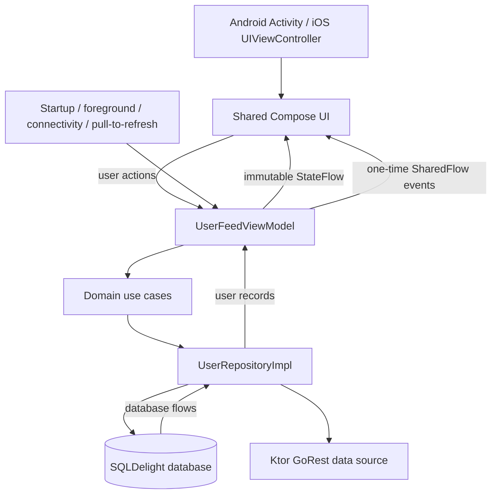

# User Management System

A production-minded Kotlin Multiplatform user directory for Android and iOS. The app shares its Compose UI, ViewModel, domain rules, repository, Ktor client, SQLDelight schema, and dependency graph.

The feed reads from the local database at all times. Network work refreshes that database in the background, so cached and locally created users remain useful through connectivity and server failures.

## What it demonstrates

- Portrait uses a one-column feed; landscape uses an exact two-column grid.
- Shared Material 3 light/dark presentation and accessible loading, empty, offline, and error states.
- Server-confirmed user creation: rows are added only after HTTP 201, and API validation errors are shown in the form.
- Long-press delete that removes the remote user first, then offers Undo to recreate it.
- Lifecycle- and connectivity-aware refreshes with one serialized repository operation at a time.
- Deterministic shared, persistence, Compose, and platform dependency-injection tests.

## Architecture

The app uses MVVM and unidirectional data flow. Platform code supplies lifecycle, connectivity, network-engine, SQL-driver, and token configuration implementations; feature behavior stays in `shared`.



The repository serializes each refresh, page load, create, restore, and delete operation. A successful initial GoRest `/users` response replaces the stored remote snapshot in one transaction; a failure leaves the current database and pagination cursor intact. Reaching the feed end appends the page named by `X-Links-Next` (`page=2`, `page=3`, and so on). New server-confirmed users have no server position until a refresh, so the query shows them first by local observation time and descending local ID. The detailed contract is in [`docs/state-transitions.md`](docs/state-transitions.md); architectural boundaries are in [`docs/architecture.md`](docs/architecture.md).

## Most important class

[`UserFeedViewModel`](shared/src/commonMain/kotlin/com/bill/usermanagmentsystem/ui/users/UserFeedViewModel.kt) is the central coordinator for the user experience. It combines the database-backed feed, connectivity, clock, and durable presentation state into one immutable UI state, and turns UI actions into explicit use-case calls for pull-to-refresh, pagination, form submission, delete, and undo. Synchronization is automatic at startup, foreground, and restored connectivity.

The ViewModel uses [`UserFeedEvent`](shared/src/commonMain/kotlin/com/bill/usermanagmentsystem/ui/users/UserFeedEvent.kt) for one-time effects: opening or dismissing the add-user sheet, showing API validation errors, Snackbars, the delete/Undo prompt, and scrolling to the newest user. The add-user field values, client-side errors, and submitting state remain immutable state so input is not lost; delete confirmation remains state because it represents an unfinished user decision. The repository owns remote calls and SQLDelight updates; the ViewModel observes the database rather than holding another copy of the feed. Form-state logic lives in [`AddUserFormState.kt`](shared/src/commonMain/kotlin/com/bill/usermanagmentsystem/ui/users/AddUserFormState.kt), while the [`presentation`](shared/src/commonMain/kotlin/com/bill/usermanagmentsystem/ui/users/presentation) package owns feed-state mapping and user-facing error messages.

### User feature structure

- [`UserFeedScreen.kt`](shared/src/commonMain/kotlin/com/bill/usermanagmentsystem/ui/users/UserFeedScreen.kt) owns route wiring, top-level layout selection, pull-to-refresh, and consumption of one-time display events. Its saved local sheet-visibility flag prevents a rotation from hiding an open form.
- [`UserFeedContent.kt`](shared/src/commonMain/kotlin/com/bill/usermanagmentsystem/ui/users/UserFeedContent.kt) renders feed loading, list/grid content, pagination, banners, and empty states.
- [`UserFeedDialogs.kt`](shared/src/commonMain/kotlin/com/bill/usermanagmentsystem/ui/users/UserFeedDialogs.kt) contains the add-user sheet/dialog, API validation alert, and delete confirmation.
- [`AddUserFormState.kt`](shared/src/commonMain/kotlin/com/bill/usermanagmentsystem/ui/users/AddUserFormState.kt) contains pure add-user form updates, validation, and API-error parsing.
- [`presentation/UserFeedUiStateMapper.kt`](shared/src/commonMain/kotlin/com/bill/usermanagmentsystem/ui/users/presentation/UserFeedUiStateMapper.kt) maps persisted users and presentation state into the immutable feed UI state.

## Prerequisites

- Android Studio with the Android SDK configured and a JDK compatible with the Gradle wrapper.
- Xcode and an Apple-silicon iOS Simulator for the iOS app and simulator tests.
- A GoRest access token for create/delete operations. Public feed loading works without one.

Never commit a real token. The local configuration files below are ignored by Git, and the tracked examples contain placeholders only.

### Shared Android and iOS token setup

Keep the `sdk.dir` generated by Android Studio in the root `local.properties`, then add:

```properties
GOREST_ACCESS_TOKEN=YOUR_GOREST_ACCESS_TOKEN
```

[`local.properties.example`](local.properties.example) contains the same placeholder. Android reads this file through Gradle; the iOS build extracts only `GOREST_ACCESS_TOKEN` from it into its local app bundle. One local token therefore configures both apps. A `GOREST_ACCESS_TOKEN` Gradle property or environment variable also works for Android and takes precedence over `local.properties` there.

The token is included in each app's local build. After changing it, rebuild and reinstall the app; simply reopening an already-installed build does not update the token.

### Optional iOS-only token override

Copy the ignored secrets template and replace the placeholder:

```shell
cp iosApp/Configuration/Secrets.xcconfig.example iosApp/Configuration/Secrets.xcconfig
```

```text
GOREST_ACCESS_TOKEN=YOUR_GOREST_ACCESS_TOKEN
```

`Config.xcconfig` optionally includes this file as a higher-priority iOS-only override. Otherwise, iOS uses the token extracted from root `local.properties`. If both are absent or blank, the feed still loads but write attempts show an authentication/configuration error. After correcting configuration, rebuild the app and use Retry.

## Run

Android:

```shell
./gradlew :androidApp:assembleDebug
```

Install/run the resulting debug app from Android Studio, or use its Android run configuration.

iOS: open `iosApp/iosApp.xcodeproj` in Xcode, choose the `iosApp` scheme and an iOS Simulator, then Run. The Xcode build invokes Gradle to produce the shared static framework.

## Test

Run the required verification suite from the repository root:

```shell
./gradlew :shared:testAndroidHostTest
./gradlew :shared:iosSimulatorArm64Test
./gradlew :androidApp:assembleDebug
```

Coverage includes incremental pagination and Retry, the compact/wide breakpoint, light/dark tokens, accessibility semantics, ViewModel state, Ktor parsing and HTTP failure classes, repository/database transitions, and Android/iOS Koin graphs. Tests use controlled dispatchers, clocks, mock HTTP engines, fakes, and temporary databases rather than the live API or real delays.

## Offline synchronization and Undo

- Create posts the form directly to GoRest. Only HTTP 201 merges the returned user into the database and displays it at the top.
- A failed create leaves no local row. HTTP 422 keeps the form open and presents the API field and message in an alert.
- Delete calls the remote endpoint first. On HTTP 204 (or an already-absent 404), the local row is removed and the UI offers Undo.
- Undo sends a new POST with the deleted user's data. A successful response is merged locally with its new remote ID; a failed restore leaves the user deleted and explains the problem.
- Refresh never clears a good cache because of an offline, authentication, rate-limit, 5xx, or malformed-response failure.
- The initial `/users` response replaces the refreshable remote snapshot. Pages named by `X-Links-Next` append in server order when scrolled into view. A page failure keeps all loaded users visible and exposes an explicit Retry without advancing the cursor.

## Technology choices and tradeoffs

- **Compose Multiplatform:** one adaptive feature UI and semantics model on Android and iOS. Native entry points remain intentionally thin.
- **SQLDelight:** typed shared persistence and transactional snapshot/page updates. This makes the database the single source observed by the UI; it also provides deterministic latest-first ordering for locally confirmed creates.
- **Ktor:** one strict GoRest contract with OkHttp and Darwin engines. Reads include the configured bearer token when present; writes require it. Debug header logging redacts authorization values.
- **Koin:** constructor-injected shared modules with small platform composition roots and replaceable test doubles.
- **Dispatchers:** the ViewModel confines orchestration and state changes to its main scope, while Ktor and SQLDelight work run on injected I/O dispatchers and feed-to-UI mapping runs on an injected default dispatcher.
- **Observed local time:** GoRest has no user creation/update timestamp, so the relative label records when a row was first observed locally rather than claiming a server event time.
- **Fixed two-column wide layout:** this follows the product contract and keeps behavior predictable; it intentionally does not grow to three or more columns on very large displays.

## AI-assisted development

AI assistance was used to explore implementation options, draft focused changes, and identify edge cases. Every accepted change was checked against the sprint briefs and state-transition contract, reviewed in the repository diff, and verified with deterministic tests and platform builds. Generated suggestions were treated as candidates rather than authority; unsupported abstractions, dependency churn, and behavior outside the documented scope were excluded.

## Known limitations

- GoRest is a public demonstration service and may reset or change its data independently of this app.
- The token is compiled into each demo binary. Ignored local files prevent source-control leakage, but this is not appropriate secret storage for a production-distributed client; a backend should own privileged credentials.
- Relative user time is based on local observation because the API provides no timestamp.
- The product intentionally targets Android and iOS only; desktop, web, user editing, and production deployment are out of scope.

## Repository map

- `shared/src/commonMain`: shared UI (screen, content, dialogs, and reusable components), ViewModel/helpers, domain, repository, Ktor, SQLDelight-facing code, and Koin modules.
- `shared/src/androidMain` / `shared/src/iosMain`: platform implementations and composition roots.
- `shared/src/commonTest`, `androidHostTest`, and `iosTest`: deterministic shared and platform verification.
- `androidApp`: Android application entry point and local token injection.
- `iosApp`: SwiftUI host, Xcode configuration, and iOS token injection.
- `docs`: product requirements, architecture, transition contract, and sprint workflow.
