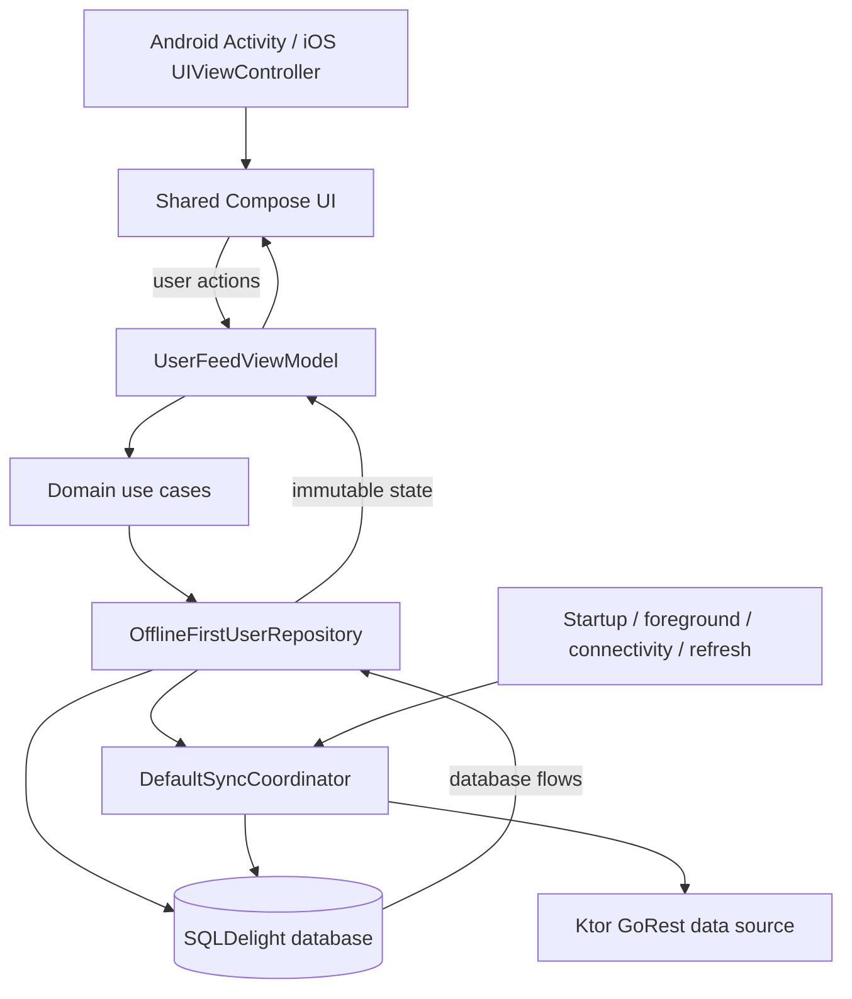

# User Management System

A production-minded Kotlin Multiplatform user directory for Android and iOS. The app shares its Compose UI, ViewModel, domain rules, offline-first repository, synchronization coordinator, Ktor client, SQLDelight schema, and dependency graph.

The feed reads from the local database at all times. Network work refreshes that database in the background, so cached and locally created users remain useful through connectivity and server failures.

## What it demonstrates

- One-column feed below 600dp and an exact two-column grid from 600dp upward.
- Shared Material 3 light/dark presentation and accessible loading, empty, offline, error, pending, and failed states.
- Offline create with a durable outbox, FIFO synchronization, persisted retry timing, and explicit recovery for permanent failures.
- Long-press delete with a durable five-second Undo window that survives process restart.
- Lifecycle- and connectivity-aware synchronization coalesced into one active run.
- Deterministic shared, persistence, Compose, and platform dependency-injection tests.

## Architecture

The app uses MVVM and unidirectional data flow. Platform code supplies lifecycle, connectivity, network-engine, SQL-driver, and token configuration implementations; feature behavior stays in `shared`.



The synchronization coordinator finalizes expired deletions, processes due mutations in FIFO order, then fetches and transactionally merges the latest GoRest page. Concurrent triggers join the active run instead of starting or queuing another full synchronization. The detailed contract is in [`docs/state-transitions.md`](docs/state-transitions.md); architectural boundaries are in [`docs/architecture.md`](docs/architecture.md).

## Prerequisites

- Android Studio with the Android SDK configured and a JDK compatible with the Gradle wrapper.
- Xcode and an Apple-silicon iOS Simulator for the iOS app and simulator tests.
- A GoRest access token for create/delete operations. Public feed loading works without one.

Never commit a real token. The local configuration files below are ignored by Git, and the tracked examples contain placeholders only.

### Android token setup

Keep the `sdk.dir` generated by Android Studio in the root `local.properties`, then add:

```properties
GOREST_ACCESS_TOKEN=YOUR_GOREST_ACCESS_TOKEN
```

[`local.properties.example`](local.properties.example) contains the same placeholder. A `GOREST_ACCESS_TOKEN` Gradle property or environment variable also works and takes precedence over `local.properties`.

### iOS token setup

Copy the ignored secrets template and replace the placeholder:

```shell
cp iosApp/Configuration/Secrets.xcconfig.example iosApp/Configuration/Secrets.xcconfig
```

```text
GOREST_ACCESS_TOKEN=YOUR_GOREST_ACCESS_TOKEN
```

`Config.xcconfig` optionally includes that file and exposes the value to the app bundle. If the file is absent or the value is blank, the feed still loads but write attempts show an authentication/configuration error. After correcting configuration, rebuild the app and use Retry.

## Run

Android:

```shell
./gradlew :androidApp:assembleDebug
```

Install/run the resulting debug app from Android Studio, or use its Android run configuration.

iOS: open `iosApp/iosApp.xcodeproj` in Xcode, choose the `iosApp` scheme and an iOS Simulator, then Run. The Xcode build invokes Gradle to produce the shared static framework.

## Test

Run the required verification suite from the repository root:

```shell
./gradlew :shared:testAndroidHostTest
./gradlew :shared:iosSimulatorArm64Test
./gradlew :androidApp:assembleDebug
```

Coverage includes the compact/wide breakpoint, light/dark tokens, accessibility semantics, ViewModel state, Ktor parsing and HTTP failure classes, retry/backoff, synchronization coalescing, SQLDelight transitions, process-reopen scenarios, and Android/iOS Koin graphs. Tests use controlled dispatchers, clocks, mock HTTP engines, fakes, and temporary databases rather than the live API or real delays.

## Offline synchronization and Undo

- Create writes the user and CREATE mutation in one local transaction. The user appears immediately as pending; synchronization later attaches the remote ID to that same local row.
- Retryable failures retain intent and persist attempt count plus the next allowed retry. HTTP 429 honors server timing; exponential backoff is bounded at five minutes.
- Authentication and permanent failures do not loop automatically. Validation failures become visible failed-sync rows with an explicit Retry action.
- Delete first hides the row and persists a five-second deadline. Undo before the deadline restores it without a network DELETE.
- When the deadline expires, one durable DELETE mutation is created. HTTP 204 and 404 complete it; retryable failures keep it queued; permanent failures restore the user and explain the problem.
- Refresh never clears a good cache because of an offline, authentication, rate-limit, 5xx, or malformed-response failure.

## Technology choices and tradeoffs

- **Compose Multiplatform:** one adaptive feature UI and semantics model on Android and iOS. Native entry points remain intentionally thin.
- **SQLDelight:** typed shared persistence and transactional state transitions. This adds schema/query code but makes outbox, deadlines, and restart behavior inspectable and deterministic.
- **Ktor:** one strict GoRest contract with OkHttp and Darwin engines. HTTP logging is deliberately not installed so authorization headers cannot enter debug output.
- **Koin:** constructor-injected shared modules with small platform composition roots and replaceable test doubles.
- **Observed local time:** GoRest has no user creation/update timestamp, so the relative label records when a row was first observed locally rather than claiming a server event time.
- **Fixed two-column wide layout:** this follows the product contract and keeps behavior predictable; it intentionally does not grow to three or more columns on very large displays.

## AI-assisted development

AI assistance was used to explore implementation options, draft focused changes, and identify edge cases. Every accepted change was checked against the sprint briefs and state-transition contract, reviewed in the repository diff, and verified with deterministic tests and platform builds. Generated suggestions were treated as candidates rather than authority; unsupported abstractions, dependency churn, and behavior outside the documented scope were excluded.

## Known limitations

- GoRest is a public demonstration service and may reset or change its data independently of this app.
- The token is compiled into each demo binary. Ignored local files prevent source-control leakage, but this is not appropriate secret storage for a production-distributed client; a backend should own privileged credentials.
- Relative user time is based on local observation because the API provides no timestamp.
- The product intentionally targets Android and iOS only; desktop, web, user editing, pagination beyond the latest page, and production deployment are out of scope.

## Repository map

- `shared/src/commonMain`: shared UI, ViewModel, domain, repository, sync, Ktor, SQLDelight-facing code, and Koin modules.
- `shared/src/androidMain` / `shared/src/iosMain`: platform implementations and composition roots.
- `shared/src/commonTest`, `androidHostTest`, and `iosTest`: deterministic shared and platform verification.
- `androidApp`: Android application entry point and local token injection.
- `iosApp`: SwiftUI host, Xcode configuration, and iOS token injection.
- `docs`: product requirements, architecture, transition contract, and sprint workflow.
